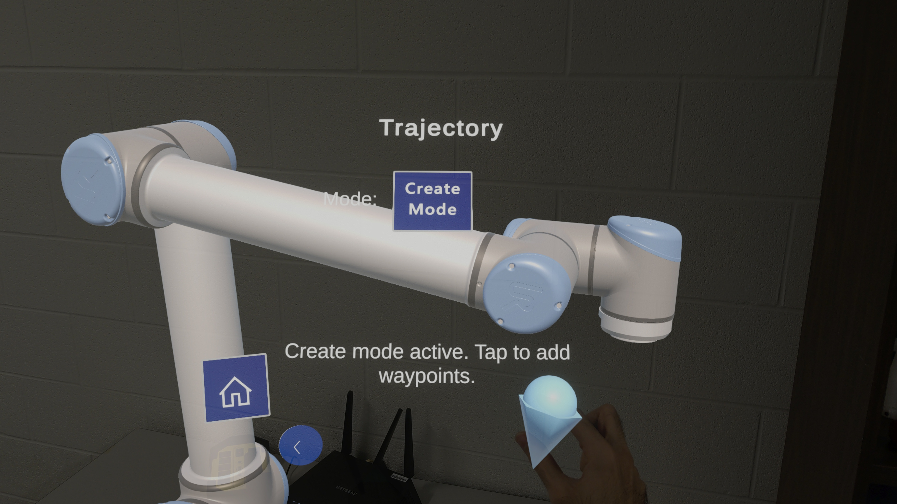
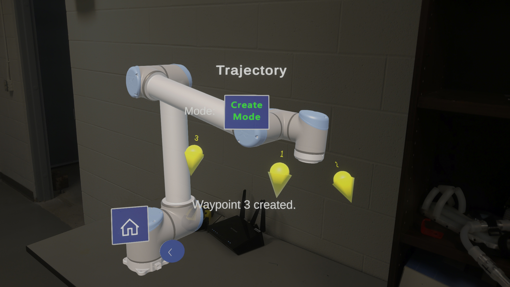
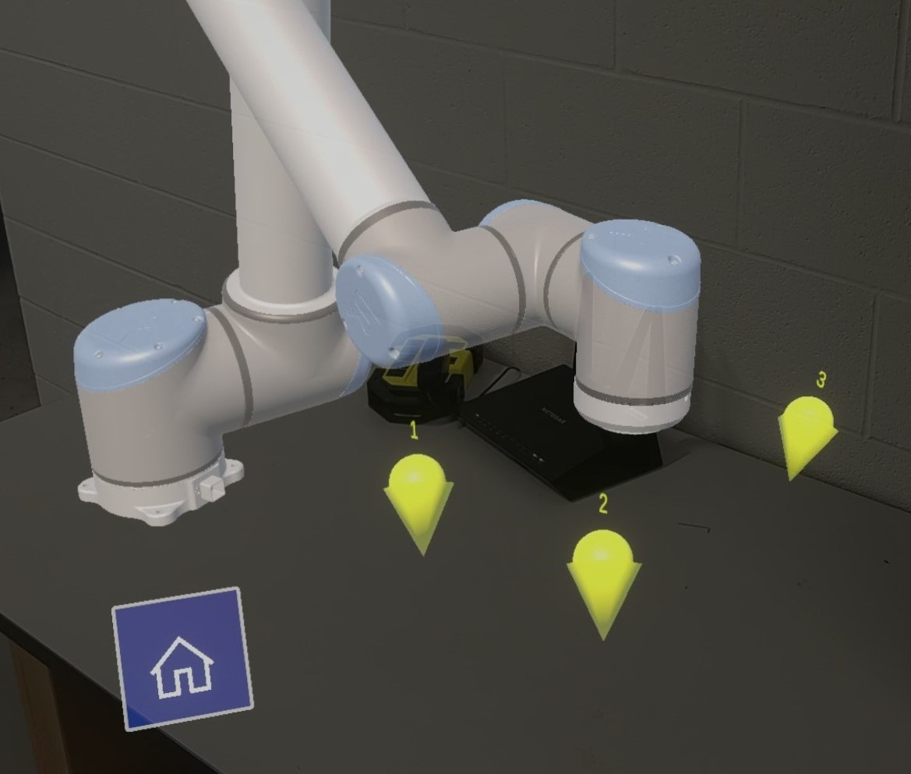
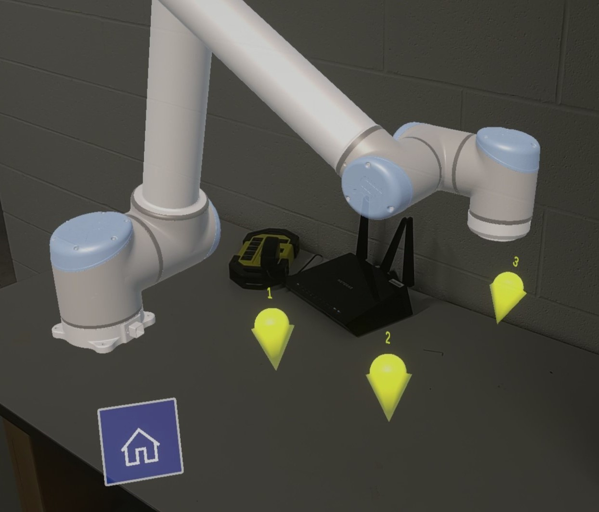
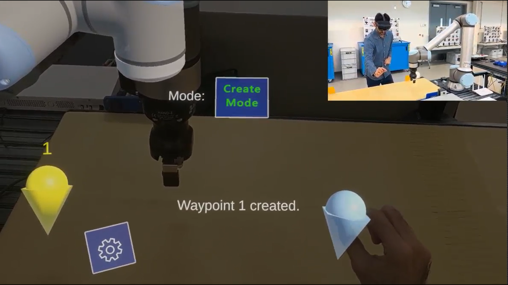
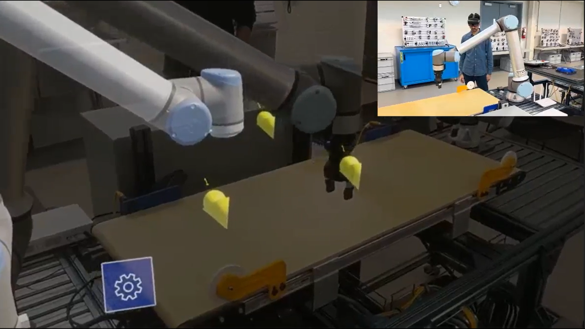

# AURaPath — Augmented Reality Waypoint determination for UR10 Robots

**AURaPath** is an end-to-end augmented reality system for **spatial waypoint determination, digital-twin preview, and execution** on a physical **Universal Robots UR10** collaborative robot using **Microsoft HoloLens 2**.

This repository contains the **full implementation used in our IEEE paper**, including:
- A Unity-based AR application for HoloLens 2
- A PC-based middleware server for robot communication
- Live execution on a physical UR10 robot

> 🔗 This repository accompanies the paper  
> **“Human–Robot Interaction for Robot Programming using Augmented Reality and Digital Twin”**

---

## 🎥 Demo — Real System, Real Robot

### End-to-End Video Demonstration
*(Waypoint Determination → Preview → Execute)*

▶️ [Watch the demo video 1](Recordings/ARUR.mp4)
▶️ [Watch the demo video 2](Recordings/twin%20-%20execute.mp4)

<video src="https://github.com/user-attachments/assets/7131f410-4359-4fb6-807a-7c5980cb8481" controls="controls" muted loop></video>

<video src="https://github.com/user-attachments/assets/66765f32-38c3-42ca-b44d-efe8e6e6dc73" controls="controls" muted loop></video>

---

### System in Use (Representative Figures)

These images correspond directly to the system described and demonstrated in the paper.

**Figure 1 — AR Waypoint Determination**  
Users place and edit 6-DoF waypoints directly in 3D space using hand interaction on HoloLens 2.

<p>
  
   
</p>

---

**Figure 2 — Digital Twin Preview (Preview-before-Execute)**  
The authored trajectory is animated on a synchronized UR10 digital twin before execution.

<p>
   
   
</p>

---

**Figure 3 — Physical Execution on UR10**  
The validated trajectory is executed on the real UR10 robot in a lab workspace.

<p>
   
   
</p>

---

## System Overview

AURaPath enables users to **select robot motion directly in the workspace** using augmented reality rather than traditional teach pendants or offline programming tools.

The system follows a structured, multi-stage workflow that makes the author–validate–execute pipeline explicit to the user:

1. **Configuration**  
   Users register and position the UR10 digital twin within the AR environment.  
   The digital twin can be spatially aligned with the physical robot for in-situ programming, or placed elsewhere (e.g., on a nearby table).

2. **Determining Trajectory**  
   Users place and edit 6-DoF end-effector waypoints relative to the digital twin using hand-based interaction.  
   Waypoints define the desired robot motion and can be iteratively refined.

3. **Preview**  
   The authored trajectory is validated and visually inspected using an animated digital twin, enabling preview-before-execute verification without moving the physical robot.

4. **Execute**  
   The validated trajectory is transmitted to the PC middleware server and executed on the physical UR10 robot.

This workflow supports intuitive spatial programming while reducing trial-and-error and improving safety in collaborative environments.

---

## System Architecture


### HoloLens 2 (AR Client)
- Unity application built with Mixed Reality Toolkit (MRTK)
- Provides hand-based interaction for waypoint placement and editing
- Visualizes a UR10 digital twin and trajectory previews
- Serializes waypoint data and transmits it to the PC server over Wi-Fi

### PC Middleware Server
- Receives waypoint data from the AR client
- Transforms poses from the AR coordinate frame into the UR10 base frame
- Performs reachability checking before preview or execution
- Generates and sends executable robot commands via URSocket / RTDE

### UR10 Robot
- Executes validated waypoint trajectories on physical hardware
- Reports joint state to initialize and synchronize the digital twin

This separation allows the AR device to focus on interaction and visualization, while the PC server handles robot-specific computation and execution.

---

## 🖥️ AR Interface Screenshots

Additional screenshots of the AR user interface, including waypoint manipulation,
menus, and interaction widgets, are available in:

[Recordings/interface/](Recordings/interface/)

These images document the full interaction design and UI elements used in the system
and correspond to the interfaces described in the paper.

---

## Hardware Requirements

The current implementation of AURaPath has been validated using the following hardware:

- **Microsoft HoloLens 2**
  - Used for AR interaction, waypoint authoring, and digital twin visualization
- **Universal Robots UR10**
  - 6-DoF collaborative robotic arm
  - Ethernet-enabled controller
- **PC / Laptop (Middleware Server)**
  - Connected to the UR10 via Ethernet
  - Connected to the HoloLens 2 via Wi-Fi
  - Used for trajectory validation and robot command execution

> ⚠️ At present, the system supports **UR10 only**. Adapting to other robot platforms would require changes to the kinematic model and communication interface.

---

## Software Requirements

### AR Client (HoloLens 2)
- **Unity** (with Universal Windows Platform support enabled)
- **Mixed Reality Toolkit (MRTK)** for HoloLens 2
- **Windows SDK** compatible with HoloLens 2 deployment
- Visual Studio (for UWP build and deployment)

### PC Middleware Server
- **Python** or **C# (.NET)** runtime (depending on server implementation)
- **URSocket / RTDE** access enabled on the UR10 controller
- Network access to the robot controller over Ethernet

### Robot
- **UR10 PolyScope** (standard installation)
- Network communication enabled

---

### 2. PC Middleware Server Setup

1. Power on the UR10 robot and controller
2. Ensure the robot is in Remote mode to allow external control
3. Connect the robot controller to the PC via Ethernet
4. Note the robot IP address (static IP is recommended)


The PC middleware server is responsible for receiving waypoint data from the HoloLens 2, transforming poses into the UR10 base frame, and transmitting executable commands to the robot controller.

#### Prerequisites
- A PC connected to the **UR10 controller via Ethernet**
- Network connectivity to the **HoloLens 2** (same LAN/Wi-Fi)
- **Python 3.x** installed
- **URSocket package is installed using pip.

> ⚠️ No additional third-party Python packages are required.  
> The server implementation relies only on standard Python libraries and URSocket
> communication supported by the UR controller.

#### Running the Server

1. Navigate to the server directory:
```bash
cd Server
```
2. Start the middleware server:

```bash
python server.py
```

3. Before execution, ensure that:

- The UR10 IP address configured in server.py matches the robot controller

- The robot is powered on and ready to accept external commands

- Network firewalls allow communication between the PC, robot, and HoloLens 2

Once running, the server listens for incoming waypoint data from the AR client and manages
trajectory validation and execution on the physical robot.

